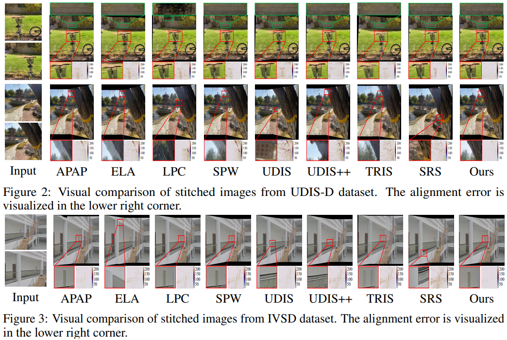
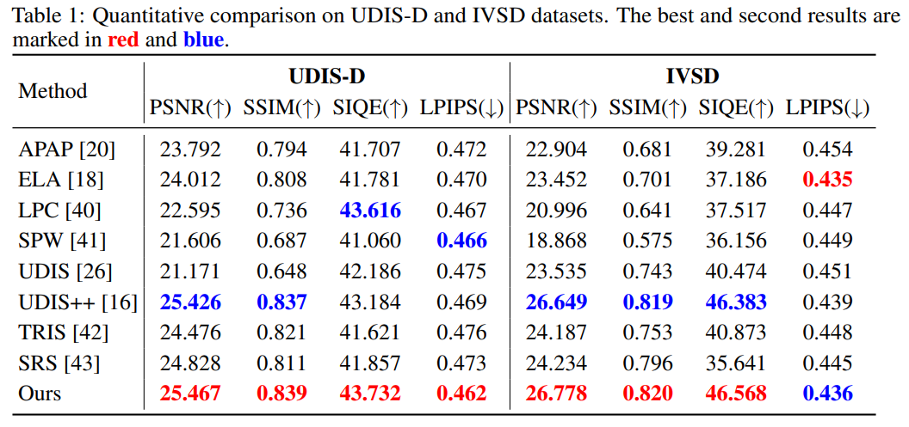

# Depth-Supervised Fusion Network for Seamless-Free Image Stitching [NeurIPS 2025]
<p align="center">
Zhiying Jiang<sup>1</sup> &ensp; Ruhao Yan<sup>2</sup> &ensp; Zengxi Zhang<sup>2</sup> &ensp; Bowei Zhang<sup>2</sup> &ensp; Jinyuan Liu<sup>2</sup>
</p>

<p align="center">
<sup>1</sup>信息科学与技术学院, 大连海事大学
</p>

<p align="center">
<sup>2</sup>软件学院、国际信息与软件学院, 大连理工大学
</p>

<p align="center">

</p>

## 更新日志
[2025-09-18] 我们的论文被NeurIPS 2025会议接收！

[2025-10-09] 开源代码与预训练模型。

## 代码

### 运行环境
- Linux
- Python 3
- numpy >= 1.19.5
- pytorch >= 1.7.1
- CUDA >= 11.0

我们通过NVIDIA RTX 3090 GPU实现该项目的训练与推理，如果您采用不同型号的GPU，请自行选择对应所需CUDA与pytorch版本。

您可以在对应路径下通过以下命令创建conda虚拟环境:
```
conda env create -f environment.yml
```


## 数据准备

### 数据集

请下载UDIS-D数据集（[谷歌网盘](https://drive.google.com/drive/folders/1kC7KAULd5mZsqaWnY3-rSbQLaZ7LujTY) 或 [百度云](https://pan.baidu.com/share/init?surl=3KZ29e487datgtMgmb9laQ?pwd=1234)）与IVSD数据集（[谷歌网盘](https://drive.google.com/file/d/1EFS0O-3KujvRJvcRx_Me5W2fdn9jRKGc) 或 [百度云](https://pan.baidu.com/share/init?surl=ZP4hgBovXnsLHcOReCGnrg&pwd=ssfv)）进行训练与推理。

训练集需要预先通过[DepthAnything](https://github.com/DepthAnything/Depth-Anything-V2/tree/main) 生成深度图。

### 预训练模型

请通过[谷歌网盘](https://drive.google.com/drive/folders/1qsvIj7iN62gdHJLytTAzfvrOZaGaqXzR)或[百度云](https://pan.baidu.com/s/1VpBGxePAbQoL7IbNspQMuA?pwd=2025)获取我们提供的预训练模型，并将其放到对应阶段的model文件夹中。


## 如何运行


### 模型训练

**变形阶段：** 请在./Warp/newCodes/train.py文件中设置好训练集的根路径，在训练集的文件夹下，输入左图、输入右图、输入深度左图、输入深度右图分别放置于input1、input2、depthInput1、depthInput2子文件夹中。完成路径设置后，在代码文件路径输入以下命令以开启训练：

```
python train.py
```

***请注意***，融合阶段的训练是依赖于变形阶段的训练结果的，因此在进行融合训练前，需要通过变形模型，生成变形图像。请在完成变形阶段训练后，输入以下命令以完成训练集变形：

```
python test_depth_output.py
```

**融合阶段：** 请在./Fusion/newCodes/train.py文件中设置好训练集的根路径，在训练集的文件夹下，变形后左图、变形后右图、变形左掩膜、变形右掩膜、变形深度左图、变形深度右图分别放置于warp1、warp2、mask1、mask2、warp_depth1、warp_depth1子文件夹中（以上数据会通过训练集变形自动创建）。完成路径设置后，在代码文件路径输入以下命令以开启训练：

```
python train.py
```

### 模型测试

**变形阶段：** 请在./Warp/newCodes/test_output.py文件中设置好测试集的根目录，并在代码文件路径输入以下命令以开启测试：
```
>python test_output.py
```
变形后图像保存在测试集根目录下。

***请注意***，与训练相同，融合阶段的测试也依赖于变形结果。

**融合阶段：** 请在./Fusion/newCodes/test.py文件中设置好训练集的根目录，并在代码文件路径输入以下命令以开启测试：
```
python test.py
```
融合后图像保存在代码文件的上一级目录下。


## 实验结果

**在UDIS-D数据集与IVSD数据集上的可视化拼接图像对比**

<p align="center">

</p>

**在UDIS-D数据集与IVSD数据集上的定量对比**

<p align="center">

</p>


## Q&A
1.通过DepthAnything生成的深度图需要彩色图还是灰度图？<br>
答：我们选择通过灰度图进行计算，因为深度图中像素点的值代表原图像中该点的相对深度，因此原始深度图应该为单通道的，而彩色深度图是通过添加伪彩色以向人们展示图像中不同区域的深度差别，目的是方便人观察，因此对于模型而言，不应该引入额外的无意义计算，采用单通道灰度深度图即可。

2.可以用其他方法生成的深度图进行计算吗？<br>
答：当然可以！本方法并不对深度图的来源进行限制，如果您采用更加优秀的深度估计方法也许会取得更优越的效果！


## 其他问题
如果您还有其他问题无法解决，请发邮件联系yanruhao1997@hotmail.com，我们将尽全力帮助您。


## 引用
等待更新。


